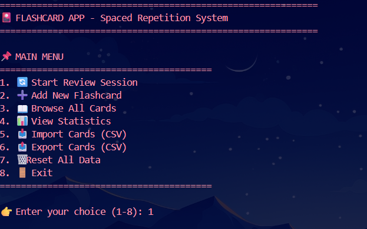
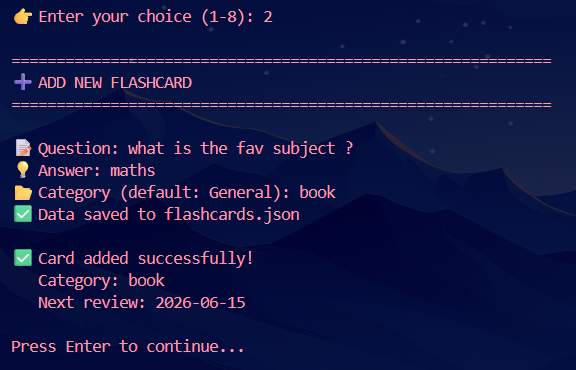
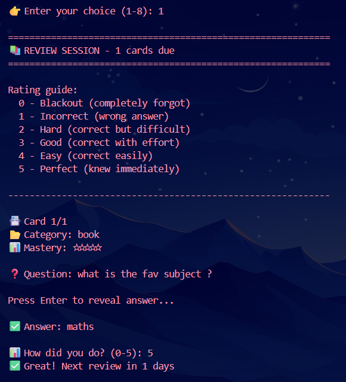

# 🎴 Flashcard App - Spaced Repetition System

A professional flashcard application with spaced repetition algorithm (SM-2) that helps you memorize information efficiently. Perfect for students, language learners, and anyone looking to master new topics.

## Features

- Spaced Repetition System - SM-2 algorithm for optimal learning
- Multiple Categories - Organize cards by subject
- Progress Tracking - Monitor mastery levels and statistics
- Import/Export - CSV support for batch operations
- Search Functionality - Find cards quickly
- Review Scheduling - Automatic due date calculation
- Mastery Levels - 0-5 rating system
- Persistent Storage - JSON-based data saving
- Statistics Dashboard - Detailed learning analytics
- Color-coded Output - Easy-to-read interface

## Quick Start

### Prerequisites
- Python 3.7 or higher
- No external libraries required (uses only built-in modules)

### Installation

1. Clone the repository:  
git clone https://github.com/poisonmunna/FlashcardApp.git  
cd flashcard-app

2. Run the application:  
python flashcard_app.py

### Basic Usage

# Run the app
python flashcard_app.py

# Use custom data file
python flashcard_app.py --data-file my_cards.json

# Import from CSV
python flashcard_app.py --import-csv cards.csv

# Export to CSV
python flashcard_app.py --export-csv my_cards.csv

## Rating Guide

| Rating | Meaning | Effect |
|--------|---------|--------|
| 0 | Blackout (completely forgot) | Reset interval |
| 1 | Incorrect (wrong answer) | Reset interval |
| 2 | Hard (correct but difficult) | Small interval increase |
| 3 | Good (correct with effort) | Normal interval increase |
| 4 | Easy (correct easily) | Large interval increase |
| 5 | Perfect (knew immediately) | Maximum interval increase |

## Spaced Repetition Algorithm

The app uses the SM-2 algorithm (used in SuperMemo and Anki):

Day 1: Learn card → Review in 1 day   
Day 2: Remember well → Review in 6 days  
Day 8: Still remember → Review in 15 days  
Day 23: Mastered → Review in 1 month+  

## Interactive Menu

======================================================================

     🎴 FLASHCARD APP - Spaced Repetition System

======================================================================

⏰ 5 cards waiting for review!

📌 MAIN MENU
========================================
1. 🔄 Start Review Session
2. ➕ Add New Flashcard
3. 📖 Browse All Cards
4. 📊 View Statistics
5. 📥 Import Cards (CSV)
6. 📤 Export Cards (CSV)
7. 🗑️ Reset All Data
8. 🚪 Exit
========================================

👉 Enter your choice (1-8): 1

## Review Session Example

======================================================================  

📚 REVIEW SESSION - 3 cards due 

======================================================================

Rating guide:  
  0 - Blackout (completely forgot)  
  1 - Incorrect (wrong answer)  
  2 - Hard (correct but difficult)  
  3 - Good (correct with effort)  
  4 - Easy (correct easily)  
  5 - Perfect (knew immediately)  

----------------------------------------------------------------------

📇 Card 1/3  
📂 Category: Programming  
📊 Mastery: ⭐⭐⭐☆☆  

❓ Question: What is Python?  

Press Enter to reveal answer...  
 
✅ Answer: A high-level programming language

📊 How did you do? (0-5): 4  
✅ Great! Next review in 6 days  

📇 Card 2/3  
📂 Category: Geography  
📊 Mastery: ⭐⭐☆☆☆  

❓ Question: What is the capital of France?

Press Enter to reveal answer...

✅ Answer: Paris

📊 How did you do? (0-5): 5
✅ Perfect! Next review in 15 days

======================================================================

📊 SESSION SUMMARY

======================================================================

✅ Cards reviewed: 3  
🎯 Correct: 3  
📈 Accuracy: 100.0%  
💪 Improvement: 3 points  

## Statistics Dashboard

====================================================================== 

📊 REVIEW STATISTICS

======================================================================

📚 Deck name: My Deck  
📇 Total cards: 50  
⏰ Due for review: 12  
⭐ Mastered cards: 15  
📖 Learning cards: 25  
🆕 New cards: 10  
📂 Categories: 5  
📈 Average mastery: 2.8/5.0

🎯 Overall progress:  
   [████████████████████░░░░░░░░░░░░░░░░] 30.0%

📂 Category breakdown:  
   Programming: 20 cards (40.0%)  
   Geography: 15 cards (30.0%)  
   History: 10 cards (20.0%)  
   Science: 5 cards (10.0%)

## CSV Import/Export Format

### Sample CSV for Import:

Question,Answer,Category    
What is Python?,A programming language,Programming  
2 + 2 = ?,4,Math  
Capital of France?,Paris,Geography   
What is OOP?,Object-Oriented Programming,Programming   

### Export Command:
python flashcard_app.py --export-csv my_cards.csv

### Import Command:
python flashcard_app.py --import-csv cards.csv

## Command Line Arguments

| Argument | Description |
|----------|-------------|
| --data-file | JSON file to store data (default: flashcards.json) |
| --import-csv | Import cards from CSV file |
| --export-csv | Export cards to CSV file |

## Browse Cards Features

Filter options:
  1. All cards
  2. By category
  3. Due for review
  4. Mastered cards
  5. New cards
  6. Search

## Card Information Display

1. ❓ What is Python?
   💡 Answer: A programming language
   📂 Category: Programming
   📊 Mastery: ⭐⭐⭐⭐☆
   📅 Next review: 2024-12-20
   🔄 Times reviewed: 5

## Mastery Levels

| Level | Icon | Description |
|-------|------|-------------|
| 0 | ☆☆☆☆☆ | Never reviewed |
| 1 | ⭐☆☆☆☆ | Just started |
| 2 | ⭐⭐☆☆☆ | Learning |
| 3 | ⭐⭐⭐☆☆ | Improving |
| 4 | ⭐⭐⭐⭐☆ | Almost mastered |
| 5 | ⭐⭐⭐⭐⭐ | Fully mastered |

## Project Structure

flashcard-app/  
│  
├── flashcard_app.py     # Main application  
├── flashcards.json      # Data storage (auto-created)  
├── README.md            # Documentation  
├── LICENSE              # MIT License  
└── .gitignore          # Git ignore file  

## Use Cases

### Language Learning
- Question: "How do you say 'Hello' in Spanish?"
- Answer: "Hola"
- Category: Spanish Vocabulary

### Exam Preparation
- Question: "What is the normal heart rate?"
- Answer: "60-100 beats per minute"
- Category: Medical

### Programming
- Question: "What does list.append() do?"
- Answer: "Adds an element to the end of a list"
- Category: Python

### History
- Question: "When did World War II end?"
- Answer: "1945"
- Category: World History

## Troubleshooting

### Cards Not Saving
- Check write permissions in the directory
- Ensure flashcards.json is not open in another program

### Import Fails
- Verify CSV format has Question,Answer,Category columns
- Check for special characters in the file

### Review Session Issues
- Make sure system date is correct
- Cards with future review dates won't appear

## Performance

- Supports: Unlimited number of cards
- Memory usage: ~1 MB per 1000 cards
- Search speed: Instant for up to 10,000 cards

## Contributing

Contributions are welcome!

1. Fork the repository
2. Create a feature branch
3. Commit your changes
4. Push to the branch
5. Open a Pull Request

## License

Distributed under the MIT License. See LICENSE file for more information.

## Contact

Your Name - 123razz321@gmail.com

Project Link: https://github.com/poisonmunna/FlashcardApp

## Show Your Support

If this project helped you learn better, please give it a star on GitHub!

---

Made with Python | Learn smarter, not harder! 📚
